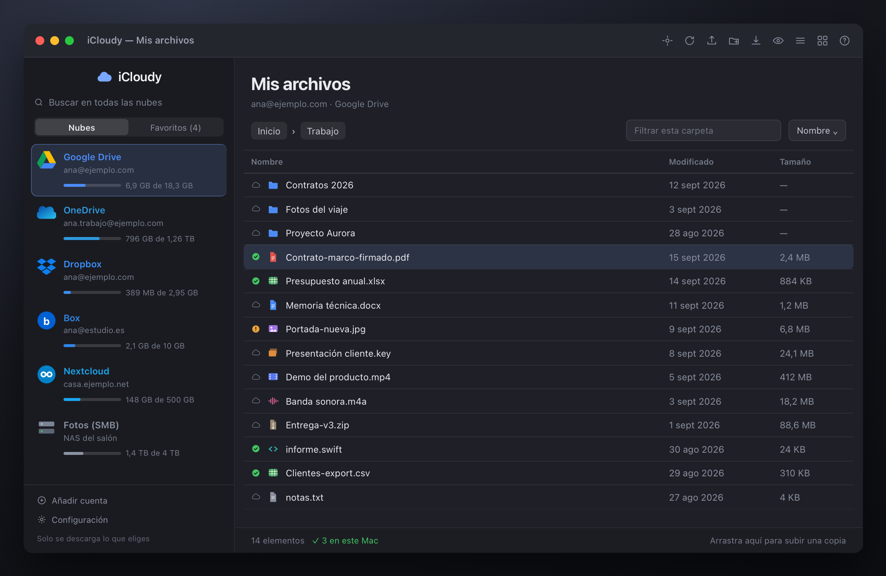
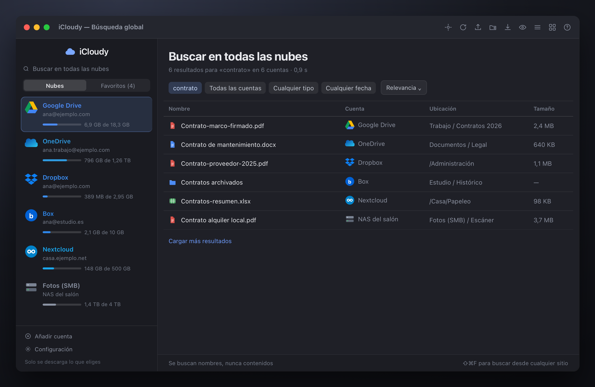
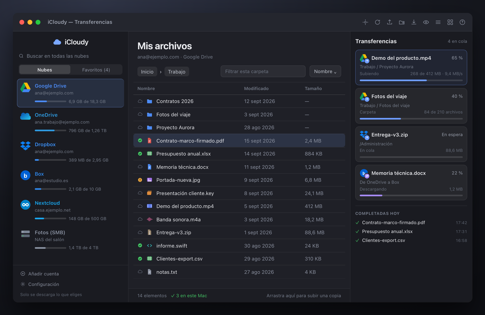

<div align="center">

# ☁️ iCloudy

### Todas tus nubes, en una sola ventana del Mac

**Google Drive · OneDrive · Dropbox · Box · Mega · Nextcloud · Synology · FTP · SMB**

[](https://github.com/ruvelro/iCloudy/releases)
[](https://www.apple.com/macos/)
[](https://swift.org)
[](https://developer.apple.com/xcode/swiftui/)
[](Tests)
[](LICENSE)

</div>

<br>



<br>

## Qué es

iCloudy es un explorador de archivos nativo para macOS que pone **todas tus nubes en la misma ventana**. Conectas
las cuentas que uses y las recorres como si fueran carpetas del Mac: navegar, buscar, previsualizar, subir, bajar
y mover archivos de una nube a otra.

No hay servidor intermedio. Tu Mac habla directamente con cada proveedor, y **nada pasa por ningún sistema de
terceros**. Tampoco sincroniza tu disco entero a tus espaldas: solo se descarga lo que tú eliges.

> [!NOTE]
> **Versión 0.1** — La base es sólida y está probada, pero es un primer lanzamiento público. Los proveedores marcados
> como experimentales pueden romperse sin aviso. Léete [estado y hoja de ruta](#-estado-y-hoja-de-ruta) antes de
> confiarle nada importante.

<br>

## ☁️ Nubes compatibles

| Nube | Acceso | Buscar | Enlaces | Papelera | Verificación | Estado |
|---|---|:-:|:-:|:-:|:-:|---|
| **Google Drive** | OAuth + PKCE | ✅ | ✅ | ✅ | MD5 | Estable |
| **OneDrive** | OAuth + PKCE | ✅ | ✅ | ✅ | SHA-256 / SHA-1 | Estable |
| **Dropbox** | OAuth + PKCE | ✅ | ✅ | ✅ | `content_hash` | Estable |
| **Box** | OAuth + PKCE | ✅ | ✅ | ✅ | SHA-1 | Estable |
| **WebDAV** | Usuario y contraseña | — | ✅¹ | — | — | Estable |
| **Volúmenes y carpetas** | Carpeta del Mac | ✅ | — | ✅² | — | Estable |
| **FTP / FTPS** | Usuario y contraseña | — | — | — | — | Estable |
| **Mega** | Correo y contraseña | ✅ | ✅ | ✅ | MAC propio³ | 🧪 Experimental |
| **O2 Cloud** | Sesión de Mi O2 | — | — | ✅ | — | 🧪 Experimental |

<sub>
¹ Enlaces públicos en Nextcloud y ownCloud, activando la API OCS al conectar.
² Papelera real y reversible del sistema, vía <code>trashItem</code>.
³ Cifrado de extremo a extremo: cada descarga se verifica contra el resumen que lleva dentro la clave del archivo.
</sub>

**WebDAV** cubre Nextcloud, ownCloud, Synology y casi cualquier NAS. **Volúmenes** cubre SMB, AFP, NFS, discos
externos y cualquier carpeta del Mac: iCloudy no implementa SMB, lo monta macOS y tú eliges la carpeta una vez.

<br>

## ✨ Lo que hace

### 🔍 Buscar en todas las nubes a la vez

Una búsqueda, todas las cuentas. Con filtros por cuenta, tipo, fecha y tamaño, resultados que van llegando según
responde cada proveedor y errores independientes: que Dropbox falle no te deja sin los resultados de Drive.



### 📤 Transferencias que no se pierden

- **Subidas por bloques y reanudables**, sin cargar el archivo entero en memoria.
- **Verificación de integridad real**: el hash se calcula sobre los mismos bloques que se envían y se compara con el
  que devuelve el proveedor. Si no coincide, la transferencia falla y te avisa.
- **Nube a nube**: copia archivos o carpetas enteras de una cuenta a otra. Se descarga a una carpeta temporal
  privada, se sube verificado y se borra. No queda nada en el Mac.
- **Cola persistente**: sobrevive al cierre de la app, se pausa sola cuando se cae la red y se reanuda cuando vuelve.



### 👀 Ver antes de bajar

Vista previa con la barra espaciadora: PDF, imágenes, texto y código, audio, vídeo, documentos de Office e iWork vía
Quick Look, y Google Docs, Sheets y Slides exportados al vuelo. Todo en solo lectura, con descarga temporal
cancelable y limpieza al cerrar.

### 🗂️ Y además

|  |  |
|---|---|
| **Nube o Mac, de un vistazo** | Cada archivo dice si solo está en la nube, si tienes copia en el Mac o si esa copia se ha quedado atrás. |
| **Reflejos de carpeta** | Eliges una carpeta del Mac y se mantiene subida y al día. Unidireccional y sin borrados: lo que borres en el Mac no desaparece de la nube. |
| **Modo sin conexión** | Se detecta la caída, se pausan las transferencias con el motivo a la vista y se sigue mostrando el último listado conocido. |
| **Personalización por cuenta** | Alias, ocho colores e iconos propios, para distinguir la cuenta del trabajo de la de casa de un golpe de vista. |
| **Espacio de verdad** | Gráfico y desglose por cuenta: archivos, papelera y —en Google— el resto de servicios. Si el proveedor no da cuota, no se inventa un porcentaje. |
| **Integrado en macOS** | Icono en la barra de menús, «Subir a iCloudy» en el menú Servicios, soltar en el Dock, Spotlight, Atajos y Automatizador. |
| **Unidades compartidas** | Unidades compartidas de Google y bibliotecas de SharePoint, sin volver a iniciar sesión. |
| **En dos idiomas** | Castellano e inglés, y añadir otro es soltar un `.lproj`. |

<br>

## 🚀 Instalación

> [!IMPORTANT]
> Todavía no hay binario publicado: la firma y notarización de Apple están en la hoja de ruta. De momento se compila
> desde el código. Necesitas macOS 14 o superior y Xcode con las herramientas de línea de comandos.

```bash
git clone https://github.com/ruvelro/iCloudy.git
cd iCloudy
bash scripts/make-signing-cert.sh   # una sola vez: evita que el Llavero pregunte en cada compilación
bash scripts/build-app.sh
open dist/iCloudy.app
```

Para conectar cuentas de Google, Microsoft, Dropbox o Box necesitas registrar tus propios identificadores OAuth —
el repositorio no incluye ninguno. La [guía de OAuth](docs/OAUTH.md) explica cómo, proveedor por proveedor.
**WebDAV, FTP, volúmenes, Mega y O2 no necesitan registro**: funcionan nada más compilar.

<br>

## 🔒 Privacidad y seguridad

- **Sin backend.** Tu Mac habla directamente con cada proveedor. No hay servidor de iCloudy por el que pasen tus
  archivos, tus nombres de archivo o tus credenciales.
- **Credenciales en el Llavero**, con `kSecAttrAccessibleWhenUnlockedThisDeviceOnly`: no salen de este Mac, no entran
  en copias de iCloud y solo se leen con la sesión desbloqueada.
- **OAuth con PKCE** y navegador externo. iCloudy nunca ve tu contraseña de Google, Microsoft, Dropbox ni Box.
- **Nada se borra de verdad.** La única eliminación es «Enviar a la papelera», reversible desde la web del proveedor.
  No hay vaciado de papelera ni borrado definitivo.
- **No se indexan contenidos.** Spotlight recibe nombres y ubicaciones, nunca lo que hay dentro de los archivos.
- **Sin telemetría.** Ninguna.

<br>

## 📍 Estado y hoja de ruta

**Ya funciona**

- [x] Nueve proveedores, con las capacidades de cada uno declaradas y la interfaz adaptada
- [x] Subidas reanudables por bloques con verificación de integridad
- [x] Búsqueda global entre cuentas con filtros
- [x] Transferencia directa de nube a nube
- [x] Reflejos de carpeta local → nube con FSEvents
- [x] Vista previa Quick Look y exportación de documentos de Google
- [x] Modo sin conexión y caché de listados
- [x] Integración con Spotlight, Atajos, Automatizador, Servicios y Dock
- [x] Castellano e inglés

**En camino**

- [ ] **Binario firmado y notarizado**, con actualizaciones automáticas
- [ ] **Integración con el Finder** mediante extensión File Provider *(necesita identificador de equipo de Apple)*
- [ ] **Sincronización bidireccional** — hoy los reflejos van solo del Mac a la nube
- [ ] **SFTP y FTPS explícito** — [por qué no están todavía](docs/FTP.md)
- [ ] **Vaciar papelera y borrado definitivo**, con las confirmaciones que eso merece
- [ ] **Compartir con permisos por persona**, más allá del enlace público de solo lectura
- [ ] **Mega**: probar el segundo factor y las cuentas anteriores a 2018 contra cuentas reales
- [ ] **Más idiomas**

<br>

## 📚 Documentación

| | |
|---|---|
| [Detalles técnicos](docs/DETALLES.md) | La referencia larga: cada función, cada límite, cada decisión |
| [OAuth](docs/OAUTH.md) | Registrar los clientes de Google, Microsoft, Dropbox y Box |
| [Mega](docs/MEGA.md) | El protocolo, la criptografía y por qué es experimental |
| [O2 Cloud](docs/O2.md) | Funambol OneMediaHub bajo la marca de O2 |
| [FTP](docs/FTP.md) | Qué hay, qué falta y lo que costaría añadirlo |
| [Vista previa](docs/PREVIEW.md) | Formatos, límites y consentimiento |

<br>

## 🛠️ Desarrollo

```bash
swift test                       # 217 pruebas, sin red: todas las respuestas HTTP están simuladas
swift run iCloudy                # iterar sobre la interfaz
swift scripts/render-mockups.swift # regenerar las capturas del README
```

Sin dependencias externas: solo SwiftUI y las bibliotecas del sistema. Las pruebas cubren desde el flujo OAuth
completo con un navegador simulado por TCP hasta la criptografía de Mega contrastada con OpenSSL.

Las capturas de este README son **maquetas**, no capturas reales: viven en `scripts/mockups` y se renderizan a PNG,
para que la documentación nunca enseñe cuentas ni archivos de nadie.

<br>

## 📄 Licencia

**[GNU General Public License v3.0](LICENSE)** — Copyright © 2026 ruvelro.

Eres libre de usar, estudiar, modificar y redistribuir iCloudy. La condición es la de siempre en la GPL: si
distribuyes una versión modificada, tienes que publicar su código bajo esta misma licencia, para que quien la reciba
tenga la misma libertad que tú tienes ahora.

Se distribuye con la esperanza de que sea útil, pero **sin garantía de ningún tipo**.

<br>

<div align="center">
<sub>Hecho con SwiftUI para macOS · iCloudy no está afiliado a Google, Microsoft, Dropbox, Box, Mega, O2 ni Apple</sub>
</div>
